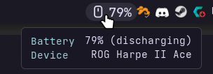

# rogctl

Battery status for ASUS mice on Linux, plus a Noctalia bar widget.

rogctl supports 27 battery-powered ROG, TUF and ASUS mice, connected through their own
receiver, a USB cable, the ROG SpeedNova 8K receiver or the ROG Omni receiver. See
[Supported mice](#supported-mice) for the list.

<p align="center">
  
</p>

## Getting started

You need a Rust toolchain (`cargo`); most distributions package it as `rust` or `rustup`.

1. **Check your mouse is supported.** Plug in its receiver or cable, run `lsusb | grep -i asus`,
   and find the USB ID in [Supported mice](#supported-mice).

2. **Install rogctl.** This puts `rogctl` in `~/.cargo/bin`, which needs to be on your `PATH`.

   ```sh
   git clone https://github.com/humblemonk/rogctl.git
   cd rogctl
   cargo install --path .
   ```

3. **Allow access to the mouse without root.** This installs a udev rule for the supported
   USB IDs:

   ```sh
   sudo cp udev/70-rogctl.rules /etc/udev/rules.d/
   sudo udevadm control --reload && sudo udevadm trigger
   ```

4. **Read the battery.**

   ```sh
   rogctl
   ```

   You should see the mouse's name and level, such as `ROG Chakram X: 80%`.

5. **Optional: add the bar widget** if you use Noctalia. See [Noctalia widget](#noctalia-widget).

## Usage

```sh
rogctl                      # "<mouse name>: 80%", plus "(charging)" when charging
rogctl --json               # one JSON status line
rogctl watch --json         # a status line every 60 s (--interval SECS)
rogctl list                 # detected devices and their /dev/hidraw nodes
```

`rogctl` exits 0 connected, 1 error, 2 no device, 3 mouse asleep. The mouse stops
answering when it sleeps; `watch` keeps reporting the last level with `"state":"asleep"`.

## Troubleshooting

- **`No supported mouse found`**: the receiver or cable isn't plugged in, or its USB ID isn't
  in [Supported mice](#supported-mice). `rogctl list` shows what was detected.
- **`Permission denied`**: the udev rule from step 3 isn't active yet. Unplug and replug the
  receiver or cable, or log out and back in.
- **`asleep or out of range`**: the mouse is off, asleep or too far from the receiver. Move it
  to wake it and run `rogctl` again.

## Noctalia widget

```sh
ln -s "$PWD/noctalia/rog-mouse-battery" ~/.local/share/noctalia/plugins/rog-mouse-battery
noctalia msg plugins enable humblemonk/rog-mouse-battery
```

Then add **ASUS Mouse Battery** from the bar's Add-widget picker, or in config:

```toml
[widget.mouse-battery]
type = "humblemonk/rog-mouse-battery:battery"
```

A background service runs `rogctl watch --json` and sends a notification when the battery
drops to the low threshold (default 20%). The widget turns red at that level, is dimmed
while the mouse sleeps, and re-reads the mouse when clicked. The refresh interval, threshold,
icon and binary path are in the plugin and widget settings.

## Supported mice

Mice not listed here aren't detected. The USB ID is what `lsusb` shows for the receiver or
cable; for the Omni receiver, rogctl asks the receiver which mouse is paired.

| Mouse | Connections (USB ID) |
|-------|----------------------|
| ROG Chakram | own receiver (`0b05:18e5`), USB cable (`0b05:18e3`) |
| ROG Chakram X | own receiver (`0b05:1a1a`), USB cable (`0b05:1a18`) |
| Gladius II Wireless | own receiver (`0b05:18a0`) |
| ROG Gladius III Aimpoint | own receiver (`0b05:1a72`), Omni receiver (`0b05:1ace`), USB cable (`0b05:1a70`) |
| ROG Gladius III Eva 2 | own receiver (`0b05:1b0c`), USB cable (`0b05:1b0a`) |
| ROG Gladius III Wireless | own receiver (`0b05:197f`), USB cable (`0b05:197d`) |
| ROG Harpe Ace Aim Lab Edition | own receiver (`0b05:1a94`), Omni receiver (`0b05:1ace`), USB cable (`0b05:1a92`) |
| ROG Harpe Ace Extreme | Omni receiver (`0b05:1ace`), USB cable (`0b05:1b67`) |
| Harpe Ace Mini | Omni receiver (`0b05:1ace`), USB cable (`0b05:1b63`) |
| ROG Harpe II Ace | SpeedNova 8K receiver (`0b05:1ad0`), USB cable (`0b05:1c69`) |
| Harpe II Extreme Edition 20 | SpeedNova 8K receiver (`0b05:1ad0`) |
| ROG Keris EVA Edition | own receiver (`0b05:1a59`), USB cable (`0b05:1a57`) |
| ROG Keris II Ace | Omni receiver (`0b05:1ace`), USB cable (`0b05:1b16`) |
| ROG Keris II Origin | Omni receiver (`0b05:1ace`), USB cable (`0b05:1c0c`) |
| ROG Keris II Origin KJP | Omni receiver (`0b05:1ace`), USB cable (`0b05:1d4c`) |
| ROG Keris Wireless | own receiver (`0b05:1960`), USB cable (`0b05:195e`) |
| ROG Keris Wireless Aimpoint | own receiver (`0b05:1a68`), Omni receiver (`0b05:1ace`), USB cable (`0b05:1a66`) |
| ASUS Mouse MD200 | own receiver (`0b05:1a24`) |
| ROG Pugio II | own receiver (`0b05:1908`), USB cable (`0b05:1906`) |
| ROG Spatha X | own receiver (`0b05:1979`), USB cable (`0b05:1977`) |
| ROG Strix Carry | own receiver (`0b05:18b4`) |
| ROG Strix Impact II Wireless | own receiver (`0b05:1949`), USB cable (`0b05:1947`) |
| Strix Impact III Wireless | Omni receiver (`0b05:1ace`) |
| TUF GAMING M4 Wireless | own receiver (`0b05:19f4`) |
| TUF GAMING Mini Miku Edition | own receiver (`0b05:1c57`), USB cable (`0b05:1c56`) |
| TX GAMING MOUSE | own receiver (`0b05:1a8d`) |
| TX GAMING MOUSE Mini | own receiver (`0b05:1af5`), USB cable (`0b05:1af3`) |

Tested on hardware so far: ROG Harpe II Ace on the SpeedNova 8K receiver. The rest are
untested, so please [report](CONTRIBUTING.md#reporting-a-problem) whether yours works.

## License

rogctl and the Noctalia plugin are licensed under the GNU Affero General Public License v3.0
or later (`AGPL-3.0-or-later`). See [LICENSE](LICENSE).
