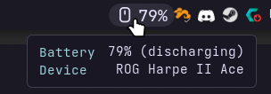

# rogctl

Battery status for ASUS mice on Linux, plus panel widgets for Noctalia, Waybar, Quickshell,
DankMaterialShell, KDE Plasma and GNOME.

rogctl supports 27 battery-powered ROG, TUF and ASUS mice, connected through their own
receiver, a USB cable, the ROG SpeedNova 8K receiver or the ROG Omni receiver. See
[Supported mice](#supported-mice) for the list.

<p align="center">
  
</p>

## Getting started

You need a Rust toolchain (`cargo`); most distributions package it as `rust` or `rustup`.

1. **Check your mouse is supported.** Find it in [Supported mice](#supported-mice).

2. **Install rogctl.** This puts `rogctl` in `~/.cargo/bin`, which needs to be on your `PATH`.

   ```sh
   git clone https://github.com/humblemonk/rogctl.git
   cd rogctl
   cargo install --path .
   ```

3. **Allow access to the mouse without root.** This installs a udev rule for the supported
   USB IDs:

   ```sh
   sudo cp udev/70-rogctl.rules /etc/udev/rules.d/
   sudo udevadm control --reload && sudo udevadm trigger
   ```

4. **Read the battery.**

   ```sh
   rogctl
   ```

   You should see the mouse's name and level, such as `ROG Chakram X: 80%`.

5. **Optional: add a panel widget.** See [Desktop widgets](#desktop-widgets).

## Usage

```sh
rogctl                      # "<mouse name>: 80%", plus "(charging)" when charging
rogctl --json               # one JSON status line
rogctl watch --json         # a status line every 60 s (--interval SECS)
rogctl watch --format waybar  # the same, as Waybar custom-module JSON
rogctl list                 # detected devices and their /dev/hidraw nodes
```

`--format` takes `text` (the default), `json` or `waybar`. `--low-threshold PCT` (default 20,
0 to turn off) sets the level at which the battery counts as low: JSON gets `"low":true` and
Waybar the `low` CSS class.

`rogctl` exits 0 connected, 1 error, 2 no device, 3 mouse asleep. The mouse stops
answering when it sleeps; `watch` keeps reporting the last level with `"state":"asleep"`.

`watch --json` also adds `"notify_low":true` to the one line where the battery first drops to
the threshold (again only after charging or rising 5% above it), and its `"pid"`. Send that
process `SIGUSR1` (`kill -USR1 PID`) to read the mouse right away.

## Troubleshooting

- **`No supported mouse found`**: the receiver or cable isn't plugged in, or the mouse isn't
  in [Supported mice](#supported-mice). `rogctl list` shows what was detected.
- **`Permission denied`**: the udev rule from step 3 isn't active yet. Unplug and replug the
  receiver or cable, or log out and back in.
- **`asleep or out of range`**: the mouse is off, asleep or too far from the receiver. Move it
  to wake it and run `rogctl` again.

## Desktop widgets

Each widget runs `rogctl` and shows the mouse's battery level in your panel or bar. It turns
red at the low threshold (default 20%), is dimmed while the mouse sleeps (showing the last
level read), and hides while no mouse is plugged in. All but Waybar also send a notification
when the battery drops to the threshold. Run the commands below from your rogctl checkout.

Widgets find `rogctl` on your desktop session's `PATH`, which may not include `~/.cargo/bin`.
If a widget says rogctl wasn't found, set its **rogctl command** setting to the full path, such
as `/home/you/.cargo/bin/rogctl`. For Waybar and Quickshell, edit the command in the config.

### Noctalia

```sh
ln -s "$PWD/noctalia/rog-mouse-battery" ~/.local/share/noctalia/plugins/rog-mouse-battery
noctalia msg plugins enable humblemonk/rog-mouse-battery
```

Then add **ASUS Mouse Battery** from the bar's Add-widget picker, or in config:

```toml
[widget.mouse-battery]
type = "humblemonk/rog-mouse-battery:battery"
```

Click the widget to read the mouse right away. The refresh interval, threshold, icon and
binary path are in the plugin and widget settings.

### Waybar

Copy the `custom/rog-mouse` module from [`waybar/config.json`](waybar/config.json) into your
Waybar config, add `"custom/rog-mouse"` to one of your `modules-*` lists, and append
[`waybar/style.css`](waybar/style.css) to your `style.css`. The icons need a Nerd Font.
`restart-interval` starts `rogctl` again 10 seconds after it exits, such as when it wasn't on
`PATH` yet.

The module gets a CSS class for the state (`connected`, `asleep`, `error`, `disconnected`),
plus `charging` and `low`; `format-icons` is keyed by the same names. Waybar can't send
notifications, so it only turns red.

### Quickshell

For a Quickshell config of your own. Copy both files next to your `shell.qml`:

```sh
cp quickshell/RogMouse.qml quickshell/RogMouseWidget.qml ~/.config/quickshell/
```

Then put `RogMouseWidget {}` in your bar. `RogMouse` is a singleton that runs one `rogctl` for
every bar; its settings are at the top of `RogMouse.qml`. `RogMouseWidget.qml` is a minimal
example (it needs a Nerd Font) to restyle, or build your own from `RogMouse.battery`,
`RogMouse.charging`, `RogMouse.low` and `RogMouse.status`. Notifications use `notify-send`.

### DankMaterialShell

```sh
ln -s "$PWD/dms/RogMouseBattery" ~/.config/DankMaterialShell/plugins/RogMouseBattery
dms ipc plugin-scan scan
```

Enable **ASUS Mouse Battery** in Settings → Plugins, then add it to the bar. Click it for
details, right-click to read the mouse right away. Notifications use `notify-send`.

### KDE Plasma 6

```sh
kpackagetool6 --type Plasma/Applet --install kde/rog-mouse-battery
```

Use `--upgrade` instead of `--install` to update it. Then add **ASUS Mouse Battery** to a panel
from Add Widgets. Click it for details, middle-click to read the mouse right away. Plasma
widgets can't stream a command's output, so this one runs `rogctl battery` every refresh
interval instead of `rogctl watch`.

### GNOME

```sh
gnome-extensions pack --force gnome/rog-mouse-battery@humblemonk.github.io
gnome-extensions install --force rog-mouse-battery@humblemonk.github.io.shell-extension.zip
```

Log out and back in, then turn on **ASUS Mouse Battery** in the Extensions app (or run
`gnome-extensions enable rog-mouse-battery@humblemonk.github.io`). Its menu shows the details
and has a Refresh item.

## Supported mice

Mice not listed here aren't detected.

- ROG Chakram
- ROG Chakram X
- Gladius II Wireless
- ROG Gladius III Aimpoint
- ROG Gladius III Eva 2
- ROG Gladius III Wireless
- ROG Harpe Ace Aim Lab Edition
- ROG Harpe Ace Extreme
- Harpe Ace Mini
- ROG Harpe II Ace
- Harpe II Extreme Edition 20
- ROG Keris EVA Edition
- ROG Keris II Ace
- ROG Keris II Origin
- ROG Keris II Origin KJP
- ROG Keris Wireless
- ROG Keris Wireless Aimpoint
- ASUS Mouse MD200
- ROG Pugio II
- ROG Spatha X
- ROG Strix Carry
- ROG Strix Impact II Wireless
- Strix Impact III Wireless
- TUF GAMING M4 Wireless
- TUF GAMING Mini Miku Edition
- TX GAMING MOUSE
- TX GAMING MOUSE Mini

Tested on hardware so far: ROG Harpe II Ace on the SpeedNova 8K receiver. The rest are
untested, so please [report](CONTRIBUTING.md#reporting-a-problem) whether yours works.

## License

rogctl and the Noctalia plugin are licensed under the GNU Affero General Public License v3.0
or later (`AGPL-3.0-or-later`). See [LICENSE](LICENSE).
